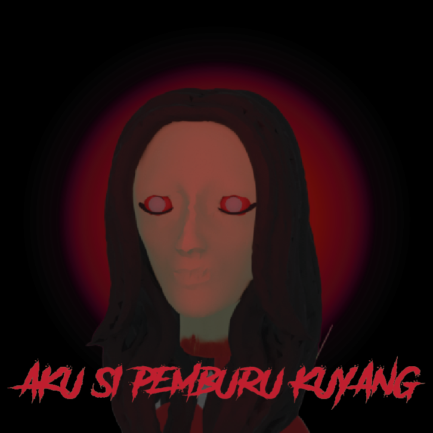

# Description

Dive into the mystical and terrifying world of "Aku Si Pemburu Kuyang," a first-person horror shooter that sets you on a perilous journey through the haunted forests of Kalimantan. As Mbah, a powerful shaman, you are tasked with the daunting challenge of ending the terror of the Kuyang, a malevolent creature stalking the night.

### Gameplay

Using an array of mystical weapons, from the mystical Revolver to the powerful Sapu Lidi, navigate through the dense, eerie woods and confront the supernatural entities that lurk in the shadows. Each weapon in your arsenal has unique properties, requiring strategic management of mystical energies to maximize your combat effectiveness.

### Features

- Engrossing Storyline: Unravel the chilling mystery behind the resurgence of the Kuyang as you follow a narrative steeped in the rich folklore of Indonesian culture.

- Dynamic Combat System: Engage in intense, first-person combat that tests your reflexes and tactical skills.

- Atmospheric Environment: Immerse yourself in beautifully crafted environments that are both enchanting and horrifying.

- Supernatural Abilities: Utilize shamanic powers to detect and combat the spectral threats.

- Multiple Game Modes: From the story-driven campaign to the relentless challenges of the endless mode, where you fight to survive as long as possible against waves of Kuyang for a spot on the leaderboard.

Embark on this eerie adventure to protect your village and restore peace to the haunted forests of Kalimantan. Are you ready to face the horrors that await in "Aku Si Pemburu Kuyang"?

### Screenshot

### Controls

| Key | Command |
| --- | --- |
| <kbd>W</kbd> <kbd>A</kbd> <kbd>S</kbd> <kbd>D</kbd> | Movement |
| <kbd>Spacebar</kbd> | Jump |
| <kbd>Left mouse button</kbd> | Shoot |
| <kbd>E</kbd> | Switch weapon |
| <kbd>Q</kbd> | Heal |
| <kbd>ESC</kbd> | Pause |

### License

Non-Commercial CC-BY-NC License

Copyright (c) 2024 Heaplow Team

Copyright (c) 2023 Kenney FPS Kit Template